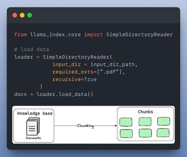

# Bước 1: Đây là những gì bạn sẽ cần chuẩn bị:
- Ollama để chạy LLM (Llama-3) trên máy tính của bạn
- Llama_Index
- Streamlit để xây dựng giao diện người dùng
- LightningAI để phát triển & lưu trữ

# Bước 2: Tải cơ sở kiến thức
Cơ sở kiến thức là một tập hợp các thông tin liên quan và cập nhật đóng vai trò là nền tảng cho RAG. Trong trường hợp này , đó là các tài liệu được lưu trữ trong một thư mục.
Đây là cách bạn có thể tải nó dưới dạng các đối tượng tài liệu trong LlamaIndex:
