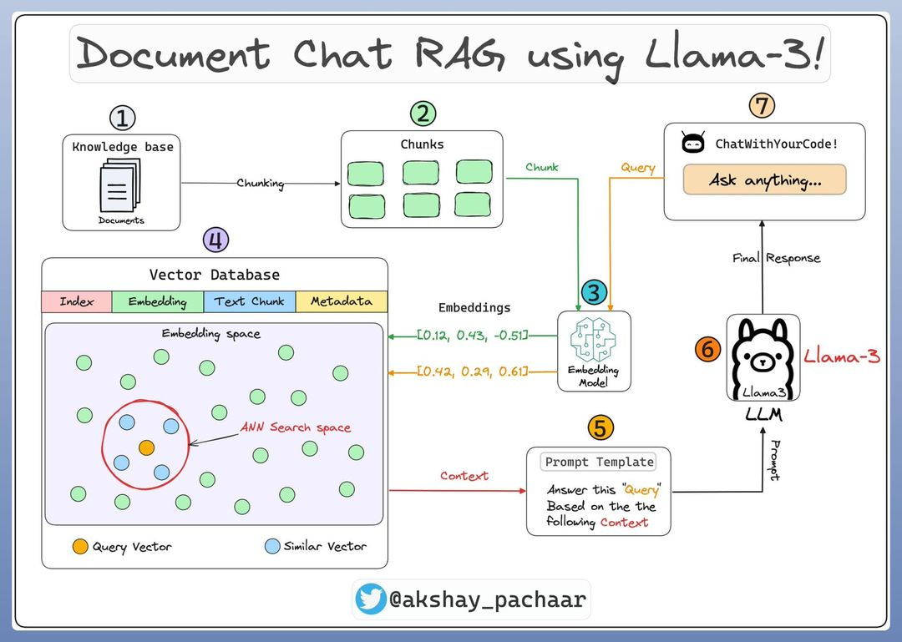
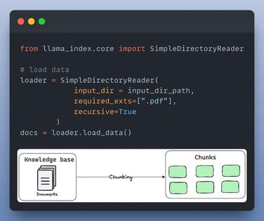
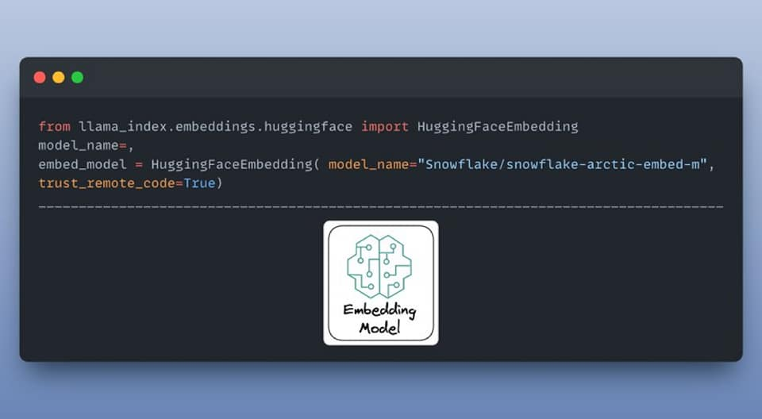
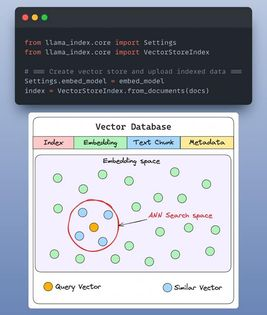
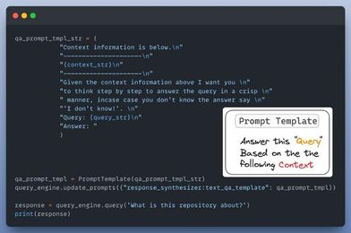
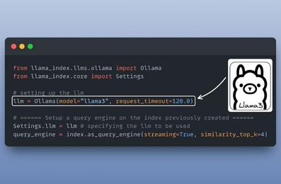
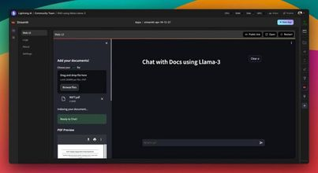

# Bước 1: Đây là những gì bạn sẽ cần chuẩn bị:
- Ollama để chạy LLM (Llama-3) trên máy tính của bạn
- Llama_Index
- Streamlit để xây dựng giao diện người dùng
- LightningAI để phát triển & lưu trữ

# Bước 2: Tải cơ sở kiến thức
Cơ sở kiến thức là một tập hợp các thông tin liên quan và cập nhật đóng vai trò là nền tảng cho RAG. Trong trường hợp này , đó là các tài liệu được lưu trữ trong một thư mục.
Đây là cách bạn có thể tải nó dưới dạng các đối tượng tài liệu trong LlamaIndex:

# Bước 3: Mô hình nhúng (embedding model)
Embedding là một đại diện có ý nghĩa của văn bản dưới dạng số.
Mô hình nhúng chịu trách nhiệm tạo nhúng cho các đoạn tài liệu và truy vấn của người dùng.
Họ đang sử dụng `arctic-embed-m` của @SnowflakeDB, một trong những mô hình tốt nhất trong phân khúc này.

# Bước 4: Lập chỉ mục (Indexing) & lưu trữ
Các nhúng được tạo bằng mô hình nhúng được lưu trữ trong một cửa hàng vectơ cung cấp khả năng truy xuất nhanh và tìm kiếm tương tự bằng cách tạo chỉ mục trên dữ liệu.
Theo mặc định, LlamaIndex cung cấp một cửa hàng vectơ trong bộ nhớ rất phù hợp để thử nghiệm nhanh chóng.

# Bước 5: Tạo một mẫu prompt
Một mẫu prompt tùy chỉnh được sử dụng để tinh chỉnh phản hồi từ LLM và bao gồm cả ngữ cảnh:

# Bước 6: Thiết lập một công cụ truy vấn
Công cụ truy vấn lấy một chuỗi truy vấn và sử dụng nó để tìm nạp ngữ cảnh có liên quan và sau đó gửi cả hai dưới dạng lời nhắc đến LLM để tạo phản hồi ngôn ngữ tự nhiên cuối cùng.
Đây là cách bạn thiết lập nó:

# Bước 7: Thiết lập Giao diện trò chuyện
Họ tạo giao diện người dùng bằng cách sử dụng Streamlit để cung cấp giao diện trò chuyện cho ứng dụng RAG.
